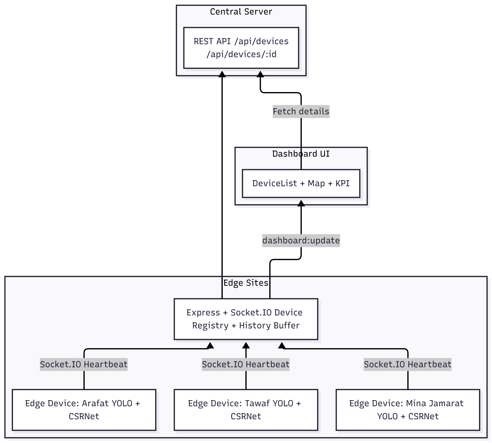
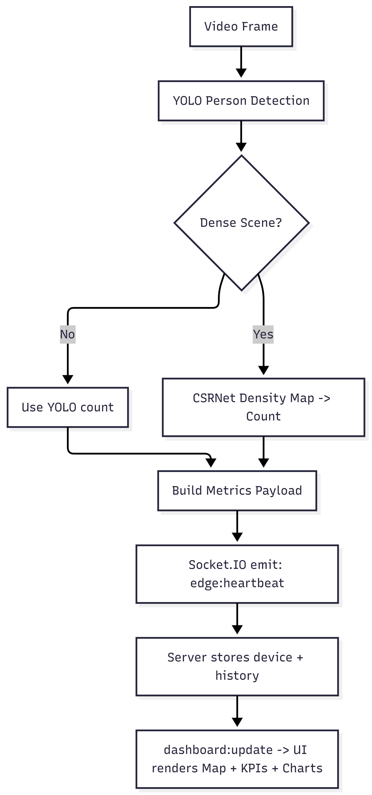
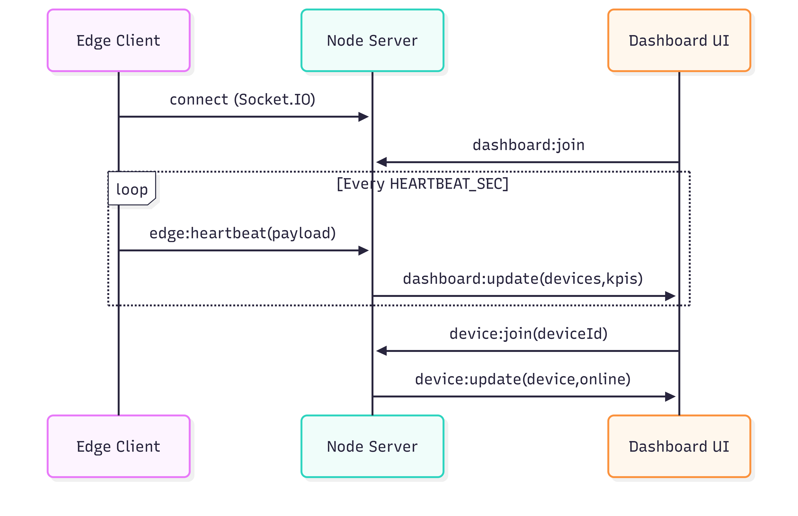

# HajjFlow: Edge Crowd Monitoring Dashboard (YOLO + CSRNet)

HajjFlow is a prototype system for real-time crowd detection, counting, and crowd-pressure monitoring using edge devices that stream metrics to a central dashboard for live visualization and decision support.

The project is aligned with **Saudi Vision 2030** and **NSDAI** by demonstrating how **computer vision + edge AI** can improve Hajj crowd safety, reduce reliance on manual CCTV monitoring, and provide actionable insights in real time.

---

## Features

### Edge Client (Python)
- Processes a video stream (file/webcam) and outputs crowd metrics.
- **YOLO** (person detection) for normal density scenes.
- **CSRNet** (density estimation) for extremely dense scenes (fallback mode).
- Sends periodic **Socket.IO heartbeat** messages to the server.
- Supports multiple simulated devices via environment variables (deviceId, zone, lat/lng, etc.).
- Debug mode (optional) for verbose logs and frame sampling.

### Dashboard Server (Node.js + Express + Socket.IO + EJS)
- Receives heartbeats and maintains device registry with online/offline status.
- Live UI: device list, zone grouping, KPIs, charts, and interactive map.
- REST endpoints for snapshot and per-device detail (useful for demos/reports).
- Offline logic (TTL) to mark devices offline when heartbeats stop.

---

## System Design Overview

### High-level Architecture

{: width="50%" }

---

## Data Flow (Heartbeat Payload)

{: width="50%" }


---

## Sequence Diagram (Edge → Server → Dashboard)

{: width="50%" }

---

## Repository Structure (suggested)

```text
.
├─ index.js
├─ package.json
├─ views/
│  └─ dashboard.ejs
├─ public/
│  └─ style.css
└─ edge_client/
   ├─ edge_client.py
   ├─ videos/
   │  ├─ tawaf.mp4
   │  ├─ jamarat.mp4
   │  └─ arafat.mp4
   └─ weights/
      └─ csrnet_shanghaitech.pth
```

---

## Requirements

### OS
- Ubuntu 20.04+ (tested on 22.04/24.04)
- Raspberry Pi / Jetson

### Server
- Node.js 18+ (recommended: 20 LTS)
- npm

### Edge Client
- Python 3.10+ (3.11/3.12 ok)
- Virtual environment (venv)
- For CPU-only testing: no CUDA required

---

## Installation

### 1) Clone and install server dependencies

```bash
git clone https://github.com/al-osaimi/hajjflow
cd hajjflow
npm install
```

### 2) Create Python venv for the edge client

```bash
cd edge_client
python3 -m venv .venv
source .venv/bin/activate
pip install --upgrade pip
```

Install Python packages:

```bash
pip install opencv-python numpy python-socketio requests torch ultralytics
```

> If you’re CPU-only, install CPU Torch from official instructions for your Python version.

---

## Model Weights

### YOLO
Use a known valid Ultralytics model name, e.g.:
- `yolov8n.pt`
- `yolo11.pt`

```bash
YOLO_MODEL=yolov8n.pt
```

### CSRNet weights
Place CSRNet weights at:
```text
edge_client/weights/csrnet_shanghaitech.pth
```

---

## Running the Project

### A) Start the Dashboard Server
```bash
npm start
```
Open: http://localhost:5000

### B) Run One Edge Device (manual)
```bash
cd edge_client
source .venv/bin/activate

BASE_URL=http://localhost:5000 \
DEVICE_ID=EDGE-TAWAF \
DEVICE_NAME="Tawaf Camera" \
ZONE="Masjid Al-Haram (Tawaf)" \
LAT=21.422487 LNG=39.826206 \
VIDEO_PATH=videos/tawaf.mp4 \
YOLO_MODEL=yolov8n.pt \
ENABLE_CSRNET=1 \
CSRNET_WEIGHTS=weights/csrnet_shanghaitech.pth \
python3 edge_client.py
```

### C) Run 3 Simulated Edge Devices (recommended demo)
```bash
npm run dev
npm run edge:all
```

---

## Configuration (Environment Variables)

### Server
| Variable | Default | Meaning |
|---|---:|---|
| PORT | 5000 | Server port |
| OFFLINE_TTL_MS | 30000 | Device offline threshold |
| HISTORY_MAX | 120 | Max history points |

### Edge Client
| Variable | Example | Meaning |
|---|---|---|
| BASE_URL | http://localhost:5000 | Server URL |
| DEVICE_ID | EDGE-TAWAF | Unique device ID |
| DEVICE_NAME | Tawaf Camera | Friendly name |
| ZONE | Masjid Al-Haram (Tawaf) | Location label |
| LAT/LNG | 21.422487/39.826206 | Map location |
| VIDEO_PATH | videos/tawaf.mp4 | Input video |
| YOLO_MODEL | yolov8n.pt | YOLO weights |
| CONF | 0.20 | Detection confidence |
| IMGSZ | 640 | Inference size |
| ENABLE_CSRNET | 1 | Enable CSRNet |
| CSRNET_WEIGHTS | weights/...pth | CSRNet weights |
| HEARTBEAT_SEC | 2.0 | Send interval |

<details>
  <summary>Edge Client – Model Parameters (Tuning Guide)</summary>
<br/>
The edge client exposes several configurable parameters that directly affect the behavior of the computer vision models (YOLO and CSRNet). These parameters allow the system to be tuned for different crowd densities, camera setups, and hardware capabilities, balancing accuracy, speed, and stability.

All parameters are provided through environment variables, allowing easy adjustment without modifying the source code.

---

### 1. YOLO Model Parameters (Person Detection)

#### YOLO_MODEL
Example:
YOLO_MODEL=yolov8n.pt

Description:
Specifies the pretrained YOLO model used for person detection.

Effect:
- Smaller models (e.g., yolov8n) → faster inference, lower accuracy
- Larger models (e.g., yolov8s, yolov8m) → slower inference, higher accuracy

When to adjust:
Use smaller models for CPU-only edge devices. Switch to larger models if people are frequently missed.

---

#### CONF – Detection Confidence Threshold
CONF=0.25

Description:
Minimum confidence score required to keep a detection.

Effect on output:
- Lower values → more detections (higher recall, more false positives)
- Higher values → fewer detections (cleaner output, risk of undercounting)

Recommended range:
0.15 – 0.35

---

#### IOU – Non-Maximum Suppression Threshold
IOU=0.45

Description:
Controls how overlapping bounding boxes are merged.

Effect on output:
- Lower IOU → aggressive merging, possible undercounting
- Higher IOU → more overlapping boxes kept, possible overcounting

Recommended value:
0.45

---

#### IMGSZ – Inference Image Size
IMGSZ=640

Description:
Resolution used for YOLO inference.

Effect:
- Higher resolution → better detection of small or distant people, lower FPS
- Lower resolution → faster inference, risk of missing people

Recommended values:
- CPU demo: 640
- Accuracy-focused: 960

---

### 2. Dense Scene Detection (YOLO → CSRNet Switching)

#### DENSE_COUNT_THR
DENSE_COUNT_THR=160

Description:
If YOLO detects more people than this threshold, the scene is classified as dense.

Effect:
- Lower threshold → CSRNet activates earlier
- Higher threshold → YOLO remains active longer

Recommended range:
120 – 200

---

#### DENSE_IOU_RATIO_THR
DENSE_IOU_RATIO_THR=0.35

Description:
Measures how much detected bounding boxes overlap. High overlap indicates heavy crowd congestion.

Effect:
- Lower value → earlier switch to CSRNet
- Higher value → later switch, YOLO used longer

Recommended range:
0.25 – 0.40

---

### 3. CSRNet Parameters (Density Estimation)

#### ENABLE_CSRNET
ENABLE_CSRNET=1

Description:
Enables or disables CSRNet for dense scene estimation.

Effect:
- 1 → CSRNet used for dense scenes
- 0 → YOLO used exclusively

---

#### CSRNET_WEIGHTS
CSRNET_WEIGHTS=weights/csrnet_shanghaitech.pth

Description:
Path to pretrained CSRNet weights.

Effect:
Weights must match the CSRNet architecture used in the code. Mismatched weights will cause CSRNet to fail and the system will fall back to YOLO.

---

### 4. Crowd Pressure Thresholds (Post-Processing)

#### LOW_THR and MID_THR
LOW_THR=60
MID_THR=140

Description:
Thresholds for mapping crowd count to pressure levels.

Effect:
- Count < LOW_THR → LOW pressure
- LOW_THR ≤ Count < MID_THR → MEDIUM pressure
- Count ≥ MID_THR → HIGH pressure

---

### 5. Runtime Reporting Parameter

#### HEARTBEAT_SEC
HEARTBEAT_SEC=2.0

Description:
Interval (in seconds) at which the edge client sends updates to the server.

Effect:
- Lower value → faster dashboard updates, more network traffic
- Higher value → smoother updates, slower reaction

Recommended range:
1.5 – 3.0
</details>

---

## Dashboard Behavior
- Devices appear **Online** if last heartbeat is within `OFFLINE_TTL_MS`.
- Map markers:
  - **LOW** (green), **MEDIUM** (amber), **HIGH** (red), **OFFLINE** (gray)
- Clicking a device card or marker opens the drawer with:
  - Count, pressure, method, YOLO FPS, IoU ratio, dense-scene, CSR time/error, and history chart.

---

## Troubleshooting

### 1) All `count=0` and `iou_ratio=0.0`
- Wrong model name or model not downloaded
- Confidence too high (`CONF=0.15–0.20`)
- Video contains no visible people
- Person class filter enabled (COCO person = class 0)

### 2) CSRNet weights fail to load
- Architecture mismatch. Use CSRNet definition matching the weight source repo.

### 3) Device stuck online after edge stops
- TTL logic handles offline after `OFFLINE_TTL_MS`.
- Optional purge logic can remove devices permanently.

### 4) Socket disconnect / dashboard not updating
- REST fallback polling is enabled.
- Check server logs and browser DevTools.

---

## Ethical & Practical Considerations
- **Privacy**: edge-only processing (no raw video transmission).
- **Bias**: validate models across lighting, angles, and demographics.
- **Security**: use TLS, device authentication, signed telemetry in production.
- **Feasibility**: match hardware to compute cost (YOLO vs CSRNet).

---

## Roadmap (Optional Enhancements)
- Heatmap overlay on the map
- Multi-camera aggregation per zone
- Device authentication
- Persistent storage for analytics
